# EKBMS — Enterprise Knowledge Base Management System

A full-stack web application for managing organizational knowledge. Built as a capstone project for the AFDE May 2026 batch.

**Stack:** React 18 + Tailwind CSS · Node.js + Express · MySQL 8 · JWT Auth

---

## Screenshots

| Login | Dashboard |
|-------|-----------|
| 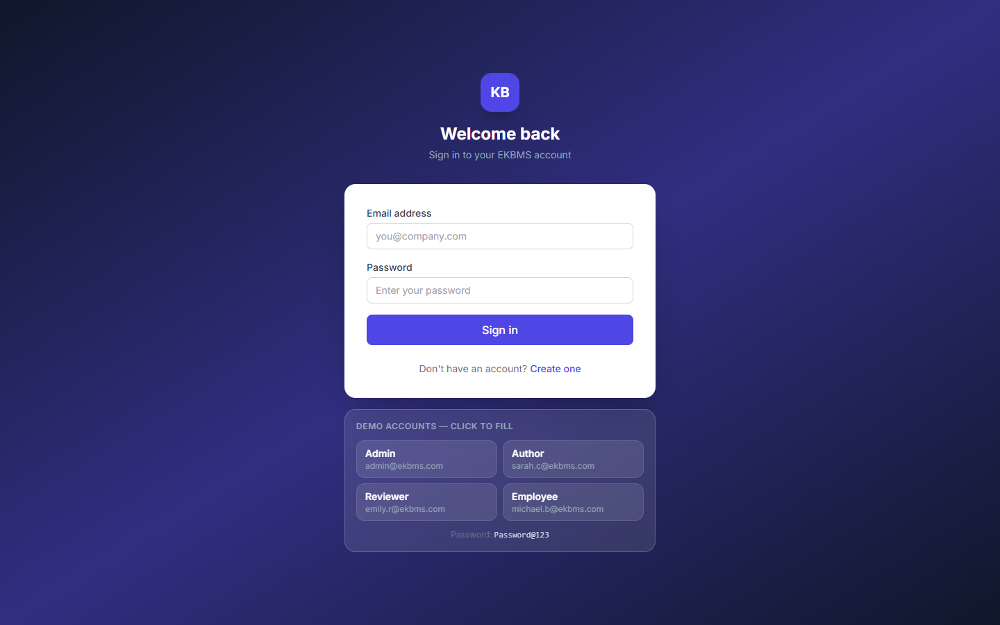 | 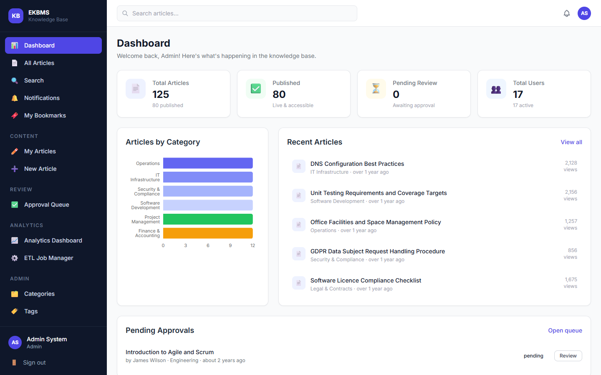 |

| All Articles | Article Detail |
|-------------|----------------|
| 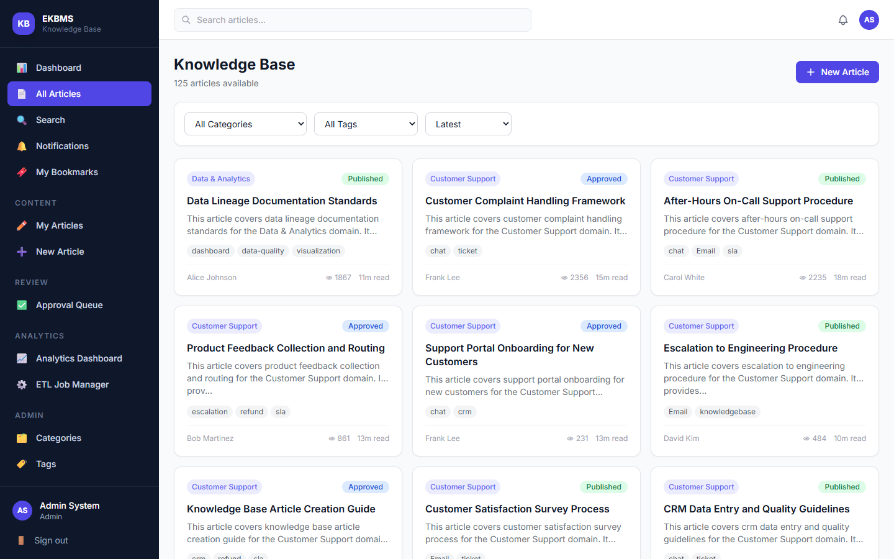 | 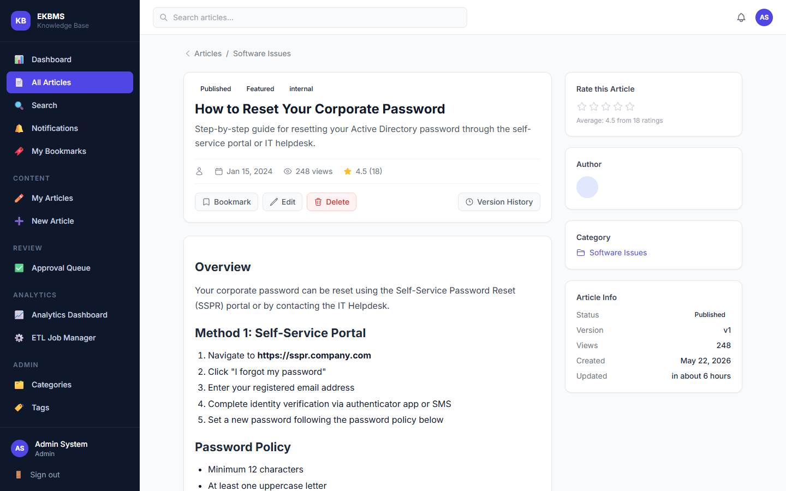 |

| New Article Editor | My Articles |
|-------------------|-------------|
| 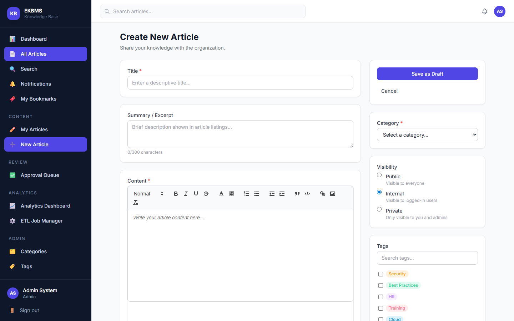 | 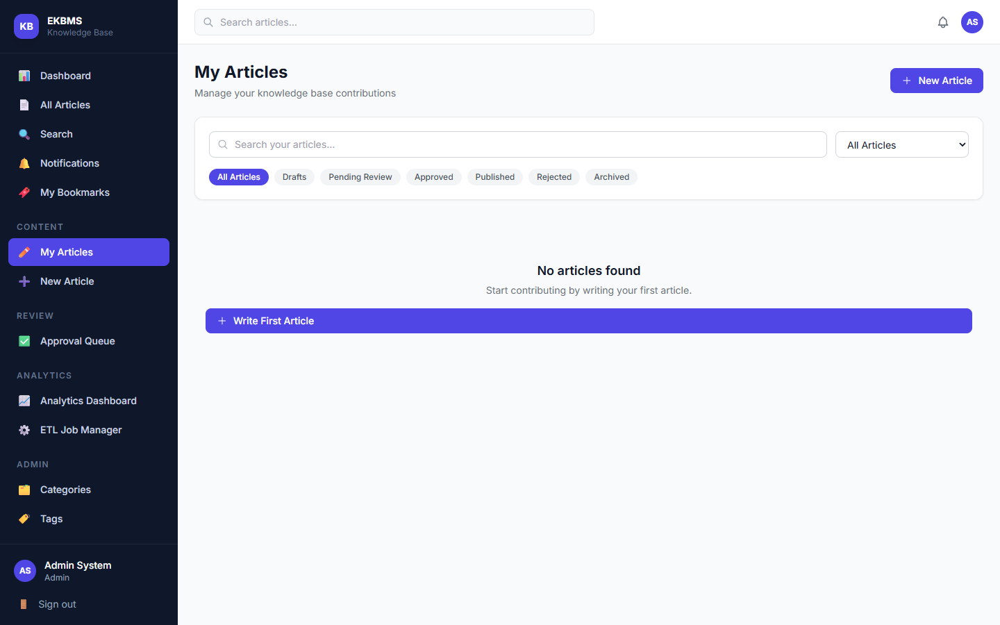 |

| Search Results | Notifications |
|---------------|---------------|
| 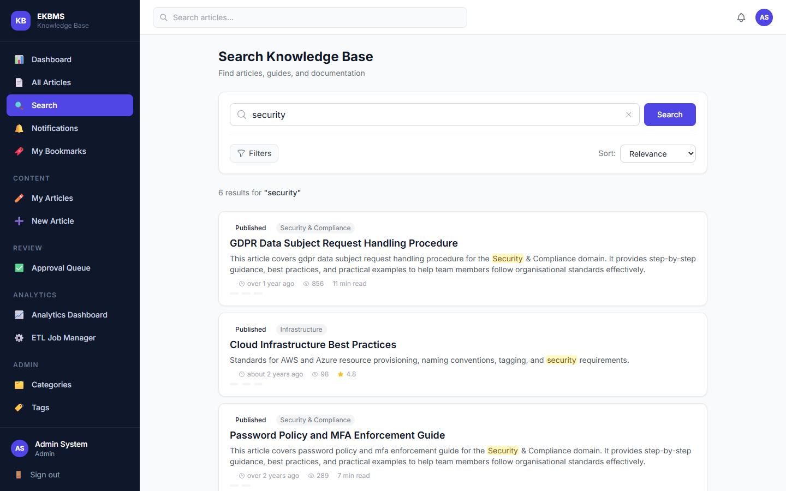 | 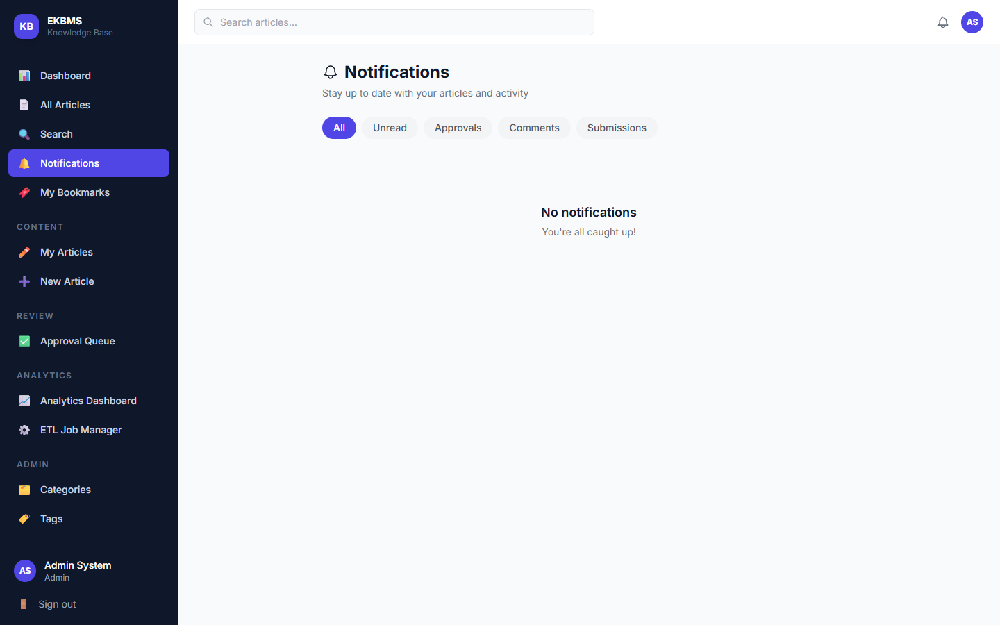 |

| Approval Queue | Analytics Dashboard |
|---------------|---------------------|
| 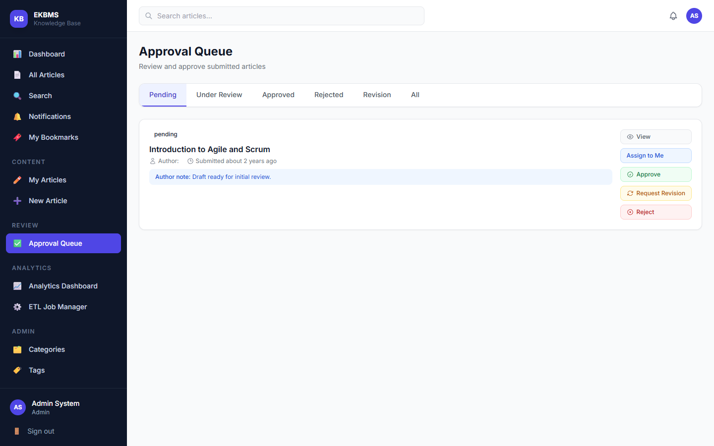 |  |

| ETL Job Manager | Admin — Users |
|----------------|---------------|
|  | 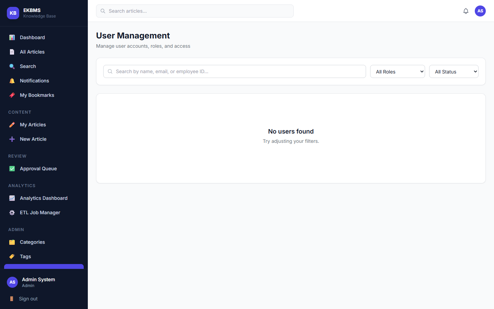 |

| Admin — Categories | Admin — Tags |
|-------------------|-------------|
| 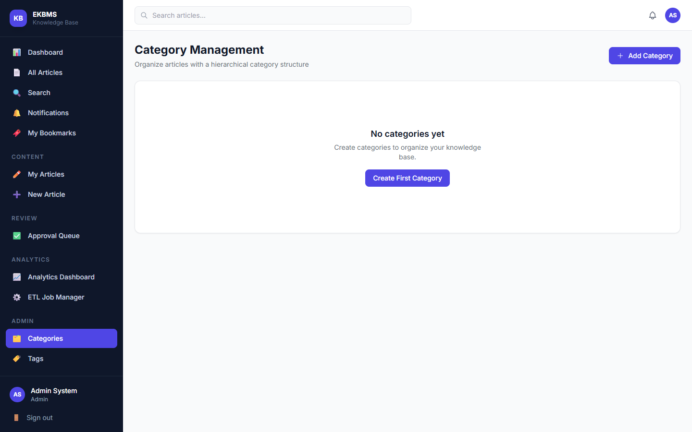 | 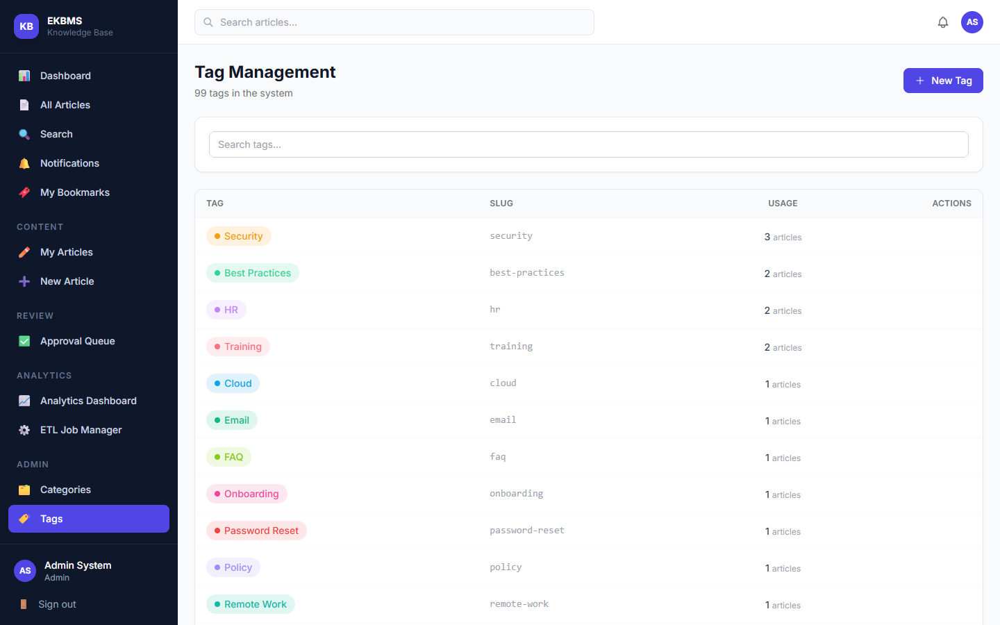 |

---

## Features

| Module | Capabilities |
|--------|-------------|
| **Authentication** | Register, Login, JWT sessions, Profile management, Password change |
| **Articles** | Rich text editor (Quill.js), versioning, lifecycle (draft → review → published → archived) |
| **Categories** | Hierarchical (parent/child), icons, color coding |
| **Tags** | Color-coded labels, usage tracking |
| **Approvals** | Submit for review, assign reviewer, approve / reject / request revision |
| **Search** | MySQL full-text search, suggestions, filters, sort options |
| **Comments** | Threaded replies on published articles |
| **Ratings** | 1–5 star ratings with rolling average |
| **Bookmarks** | Save articles for later |
| **Notifications** | Real-time in-app notifications for all workflow events |
| **Attachments** | File uploads (PDF, images, docs) linked to articles |
| **Dashboard** | Stats, category charts (Recharts), recent + popular articles |
| **Admin** | User management, role assignment, category & tag CRUD |

---

## Role Permissions

| Role | Can Do |
|------|--------|
| **Admin** | Everything — user management, all content, categories, tags |
| **Reviewer** | Review and approve/reject submitted articles |
| **Author** | Create, edit, submit their own articles |
| **Employee** | Read published articles, comment, rate, bookmark |

---

## Project Structure

```
Enterprise_Knowledge_base_management_system/
├── database/
│   ├── schema.sql          # 13-table MySQL schema
│   └── seed.sql            # Sample data (10 users, 14 categories, 7 articles)
├── backend/
│   ├── src/
│   │   ├── app.js          # Express app (CORS, routes, middleware)
│   │   ├── server.js       # HTTP server entry point
│   │   ├── config/
│   │   │   ├── db.js       # MySQL2 connection pool
│   │   │   └── multer.js   # File upload config
│   │   ├── controllers/    # 13 controllers (auth, articles, approvals, ...)
│   │   ├── routes/         # 13 route files
│   │   ├── middleware/     # auth (protect/authorize/optionalAuth), errorHandler, validate
│   │   └── utils/          # response helpers, slugify, pagination
│   ├── uploads/            # Uploaded files (gitignored)
│   ├── .env.example        # Copy to .env and fill in your values
│   └── package.json
└── frontend/
    ├── public/index.html
    ├── src/
    │   ├── App.jsx             # Routes + guards (PrivateRoute, RoleRoute)
    │   ├── context/AuthContext.jsx
    │   ├── services/           # 11 axios service files
    │   ├── components/
    │   │   ├── common/         # Badge, Modal, Spinner, Pagination, EmptyState, ConfirmDialog
    │   │   └── layout/         # Sidebar, Header, Layout
    │   ├── pages/
    │   │   ├── auth/           # Login, Register, Profile
    │   │   ├── dashboard/      # Dashboard with charts
    │   │   ├── articles/       # ArticleList, ArticleDetail, ArticleForm, MyArticles, Bookmarks
    │   │   ├── admin/          # ApprovalQueue, CategoryManagement, TagManagement, UserManagement
    │   │   ├── search/         # SearchResults
    │   │   └── notifications/  # NotificationsPage
    │   └── utils/helpers.js    # formatDate, timeAgo, STATUS_COLORS, truncate, stripHtml
    └── package.json
```

---

## Setup & Installation

### Prerequisites
- Node.js 18+
- MySQL 8.0+
- npm

### 1. Clone the repository
```bash
git clone https://github.com/Sanjana-Boligorla/AFDE_May26_Sanjana_EKBMS.git
cd AFDE_May26_Sanjana_EKBMS
```

### 2. Create the database
```bash
mysql -u root -p
```
```sql
CREATE DATABASE ekbms_db CHARACTER SET utf8mb4 COLLATE utf8mb4_unicode_ci;
EXIT;
```
```bash
mysql -u root -p ekbms_db < database/schema.sql
mysql -u root -p ekbms_db < database/seed.sql
```

### 3. Configure the backend
```bash
cd backend
cp .env.example .env
```
Edit `.env` — set your MySQL password:
```
DB_PASSWORD=your_mysql_root_password
```

### 4. Install & start the backend
```bash
cd backend
npm install
npm run dev
```
Backend runs at `http://localhost:8000`  
Health check: `http://localhost:8000/api/health`

### 5. Install & start the frontend
```bash
cd frontend
npm install
npm start
```
Frontend opens at `http://localhost:3000`

---

## Demo Accounts

All accounts use password: **`Password@123`**

| Role | Email |
|------|-------|
| Admin | admin@ekbms.com |
| Reviewer | emily.r@ekbms.com |
| Author | sarah.c@ekbms.com |
| Author | john.doe@ekbms.com |
| Employee | michael.b@ekbms.com |
| Employee | alice.johnson@ekbms.com |

---

## API Overview

All endpoints are prefixed with `/api`.

| Resource | Endpoints |
|----------|-----------|
| Auth | `POST /auth/register` · `POST /auth/login` · `GET /auth/me` · `PUT /auth/me` · `PUT /auth/change-password` |
| Articles | `GET /articles` · `POST /articles` · `GET /articles/:id` · `PUT /articles/:id` · `DELETE /articles/:id` · `POST /articles/:id/submit` · `POST /articles/:id/publish` · `POST /articles/:id/archive` · `GET /articles/:id/versions` · `GET /articles/my` |
| Categories | `GET /categories` · `POST /categories` · `PUT /categories/:id` · `DELETE /categories/:id` |
| Tags | `GET /tags` · `POST /tags` · `PUT /tags/:id` · `DELETE /tags/:id` |
| Approvals | `GET /approvals` · `PUT /approvals/:id/assign` · `PUT /approvals/:id/approve` · `PUT /approvals/:id/reject` · `PUT /approvals/:id/revision` |
| Comments | `GET /comments/article/:id` · `POST /comments/article/:id` · `PUT /comments/:id` · `DELETE /comments/:id` |
| Ratings | `POST /ratings/article/:id` · `GET /ratings/article/:id` |
| Bookmarks | `GET /bookmarks` · `POST /bookmarks/:articleId` · `DELETE /bookmarks/:articleId` |
| Notifications | `GET /notifications` · `PUT /notifications/:id/read` · `PUT /notifications/read-all` |
| Search | `GET /search?q=` · `GET /search/suggestions?q=` |
| Dashboard | `GET /dashboard/stats` · `GET /dashboard/popular` · `GET /dashboard/recent` · `GET /dashboard/category-stats` |
| Users (Admin) | `GET /users` · `PUT /users/:id` · `PUT /users/:id/toggle` · `GET /users/roles` |
| Attachments | `POST /attachments/:articleId` · `GET /attachments/:id/download` · `DELETE /attachments/:id` |

---

## Database Schema

13 tables: `roles` · `users` · `categories` · `tags` · `articles` · `article_tags` · `article_versions` · `attachments` · `approval_workflows` · `comments` · `article_ratings` · `bookmarks` · `notifications`

Key design decisions:
- **Stateless JWT** — no sessions table, token decoded on every request
- **Hierarchical categories** — `parent_id` self-reference
- **Full-text search** — MySQL `MATCH ... AGAINST` on `(title, content, summary)`
- **Inline approval comments** — reviewer feedback stored directly on workflow row
- **Denormalized ratings** — `avg_rating` and `rating_count` on articles table for fast reads

---

## Tech Stack

| Layer | Technology |
|-------|-----------|
| Frontend | React 18, React Router v6, Tailwind CSS 3, Axios |
| Editor | React-Quill (Quill.js) |
| Charts | Recharts |
| Notifications | react-hot-toast |
| Backend | Node.js 18, Express 4 |
| Database | MySQL 8 (mysql2/promise) |
| Auth | JSON Web Tokens (jsonwebtoken + bcryptjs) |
| File Uploads | Multer (disk storage, UUID filenames) |
| Validation | express-validator |

---

*AFDE May 2026 — Sanjana Boligorla*
